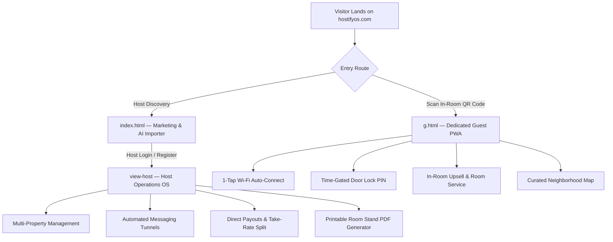

# 🎨 HostifyOS — Design System & Architecture Specification (`DESIGN.md`)

> **Version:** 2.0.0  
> **Aesthetic Philosophy:** *Luxe Obsidian Hospitality OS* (Linear.app precision meets Airbnb Luxe / Aman Resorts elegance)  
> **Grid Standard:** Strict 8px Spatial System  
> **Compliance:** Anti-Slop Guardrails & WCAG AA Accessibility  

---

## 1. 🏛️ Core Philosophy & Brand Persona

HostifyOS is engineered as the premier operating system for luxury vacation rental hosts, boutique hotels, and property managers. It balances two distinct, high-impact surfaces:

1. **Host Operations OS (Desktop/Tablet):** High-density, data-driven, dark obsidian interface prioritizing speed, revenue tracking, automated messaging tunnels, and instant property controls.
2. **Guest Concierge Portal (`g.html` / Mobile PWA):** Zero-friction, app-less mobile web experience delivering 1-tap Wi-Fi connection, time-gated digital lockbox codes, local curated recommendations, and in-room upsell orders.

---

## 2. 🎨 Color Palette & Design Tokens

HostifyOS enforces a curated obsidian color palette. **Generic purple-to-blue linear gradients are strictly prohibited.**

### CSS Custom Properties (`:root`)

```css
:root {
  /* ==========================================================================
     1. BACKGROUND & SURFACE LAYERS (Obsidian Dark)
     ========================================================================== */
  --bg-canvas: #080C14;           /* Deepest obsidian background */
  --bg-surface: #0E1526;          /* Primary card and section background */
  --bg-surface-elevated: #162038; /* Modals, dropdowns, and active states */
  --bg-surface-subtle: #0B101D;   /* Inset boxes, code blocks, input fills */

  /* ==========================================================================
     2. BRAND ACCENTS & FUNCTIONAL COLORS
     ========================================================================== */
  --accent-primary: #10B981;      /* Emerald Mist: Primary CTA, Wi-Fi, Success */
  --accent-primary-hover: #059669;/* Dark Emerald for hover & active states */
  --accent-primary-glow: rgba(16, 185, 129, 0.18); /* Focus rings & subtle ambient halos */
  
  --accent-gold: #F59E0B;         /* Champagne Amber: Upsells, Ratings, Revenue */
  --accent-gold-glow: rgba(245, 158, 11, 0.15);

  --accent-danger: #EF4444;       /* Crimson: Cancellation, Error states */
  --accent-info: #38BDF8;         /* Cyan Sky: Informational badges & tooltips */

  /* ==========================================================================
     3. TYPOGRAPHY & CONTENT COLORS
     ========================================================================== */
  --text-primary: #F8FAFC;        /* High-contrast crisp white */
  --text-secondary: #CBD5E1;      /* Secondary titles, input labels */
  --text-muted: #94A3B8;          /* Body copy, captions, subtexts */
  --text-dim: #64748B;            /* Disabled text, placeholder text */

  /* ==========================================================================
     4. BORDERS & SHADOWS (Hardware-Accelerated Precision)
     ========================================================================== */
  --border-subtle: rgba(255, 255, 255, 0.07);
  --border-strong: rgba(255, 255, 255, 0.15);
  --border-accent: rgba(16, 185, 129, 0.35);

  --shadow-card: 0 12px 32px -4px rgba(0, 0, 0, 0.5);
  --shadow-elevated: 0 24px 48px -8px rgba(0, 0, 0, 0.7);
  --shadow-glow: 0 0 24px -2px rgba(16, 185, 129, 0.25);

  /* ==========================================================================
     5. BORDER RADIUS
     ========================================================================== */
  --radius-sm: 8px;
  --radius-md: 12px;
  --radius-lg: 16px;
  --radius-xl: 24px;
  --radius-full: 9999px;
}
```

---

## 3. ✍️ Typography Hierarchy

The typographic system uses **Plus Jakarta Sans** for both Display Headings and Body Copy, delivering geometric precision and international SaaS authority.

| Element | Size | Weight | Line Height | Letter Spacing | Color Token |
| :--- | :--- | :--- | :--- | :--- | :--- |
| **Hero Title (H1)** | `52px` | `800` | `1.10` | `-0.035em` | `--text-primary` |
| **Section Title (H2)** | `32px` | `800` | `1.20` | `-0.025em` | `--text-primary` |
| **Card Title (H3)** | `20px` | `700` | `1.30` | `-0.015em` | `--text-primary` |
| **Subhead / Feature Lead**| `16px` | `600` | `1.40` | `0` | `--text-secondary` |
| **Body Text** | `15px` | `400` / `500` | `1.60` | `0` | `--text-muted` |
| **Small / Captions** | `13px` | `500` | `1.50` | `0` | `--text-muted` |
| **Eyebrow / Badges** | `11px` | `700` | `1.00` | `+0.080em` | `--accent-primary` |

---

## 4. 📏 8px Spatial Scale & Layout Grids

All margins, paddings, gaps, and structural heights MUST be multiples of **8px**:

$$\text{Scale: } 8\text{px} \to 16\text{px} \to 24\text{px} \to 32\text{px} \to 48\text{px} \to 64\text{px} \to 96\text{px}$$

### Layout Patterns:
1. **Asymmetrical Bento Grid:**
   - Hero Showcase: **60% Left** (Interactive Phone Simulator & Scannable QR Code) + **40% Right** (Value Hooks & Trust Signals).
   - Lead Magnet Section: Centered max-width `580px` high-density card with emerald focus glow.
2. **Section Spacing:**
   - Desktop vertical padding: `96px 0`.
   - Mobile vertical padding: `48px 0`.
3. **Container Widths:**
   - Wide Marketing Layout: `max-width: 1200px`.
   - Host Dashboard Layout: `max-width: 1440px`.
   - Standalone Guest Guide (`g.html`): `max-width: 680px`.

---

## 5. 📱 Component Standards

### A. Buttons (`.btn-hero-primary`, `.btn-action`)
- **Padding:** `14px 24px` (Desktop), `12px 20px` (Mobile).
- **Background:** `linear-gradient(135deg, #10B981 0%, #059669 100%)`.
- **Border:** `1px solid rgba(255, 255, 255, 0.15)`.
- **Hover State:** `transform: translateY(-1px); box-shadow: 0 8px 20px rgba(16, 185, 129, 0.35);`.
- **Active State:** `transform: translateY(0);`.

### B. Interactive Phone Simulator (`.phone-mockup-container`)
- Real hardware-style chassis with subtle ambient lighting.
- Top status pill displaying live guest state (`● Guest Online`).
- Smooth 5-tab switcher (`📶 Wi-Fi`, `🔑 Smart Lock`, `🍷 Room Service`, `📋 Rules`, `📍 Guide`).

### C. Scannable Live QR Generator (`.qr-code-box`)
- High-contrast pure white backdrop with `12px` rounded corners.
- Dynamic high-resolution vector QR code target: `https://www.hostifyos.com/g.html`.
- Ambient emerald glow behind the frame.

---

## 6. 🚫 Anti-Slop (Quality Enforcements)

To ensure HostifyOS remains a distinguished, top-tier SaaS product:

1. **NO Generic Gradients:** No purple-to-blue or pink-to-yellow meshes. All accents originate from curated emerald, slate, and amber tokens.
2. **NO Emoji Icons in Core UI:** All user interface icons MUST be rendered as clean SVG vector icons (**Lucide Icons**).
3. **NO Decorative Blur Slop:** Avoid meaningless frosted glass layers that hinder readability. Use crisp 1px borders with dark tinted elevations.
4. **NO Placeholder Copy:** No "Lorem Ipsum", no fake testimonials. All marketing copy represents verified vacation rental hosting metrics.

---

## 7. 🌐 Dual-Surface Architectural Specification



---

## 8. 🧪 Verification & Acceptance Checklist

Before any code deployment to production:
- [x] All CSS variables trace strictly to tokens defined in `DESIGN.md`.
- [x] All padding, margin, and gap values conform to the 8px scale.
- [x] Text elements meet WCAG AA contrast ratio ($\ge 4.5:1$ for body, $\ge 3:1$ for headings).
- [x] Touch targets on mobile interfaces exceed the minimum standard of $44 \times 44\text{px}$.
- [x] Standalone guest route (`g.html`) loads cleanly in $<1\text{s}$ with zero navigation clutter.
